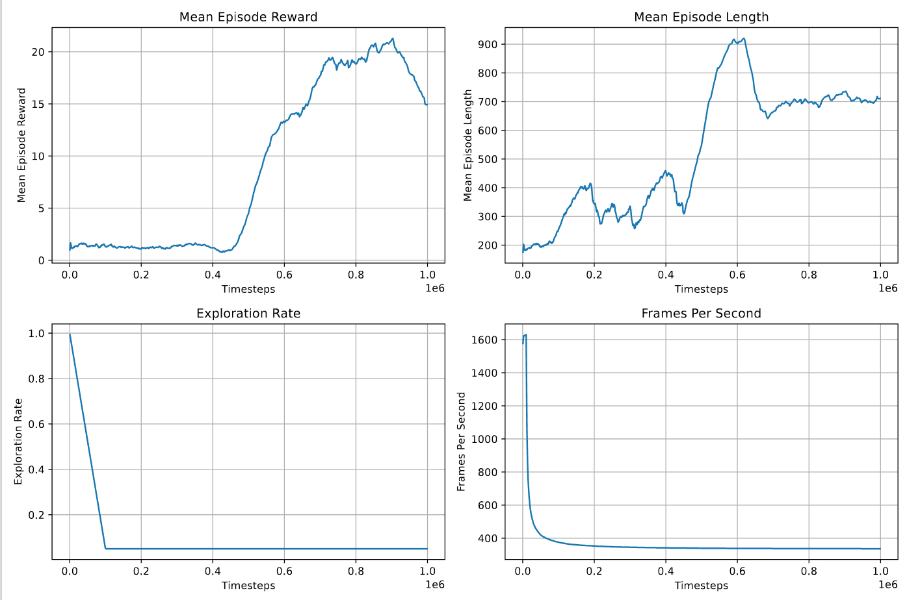

# Atari Breakout Reinforcement Learning: DQN and QR-DQN

A comparison of Deep Q-Network (DQN) and Quantile Regression DQN (QR-DQN) agents trained to play Atari Breakout from visual observations.

The project uses Gymnasium's `ALE/Breakout-v5` environment, Atari preprocessing, stacked frames, convolutional policies, Stable-Baselines3, and `sb3-contrib`. Training runs log metrics to TensorBoard and save model checkpoints. Supporting scripts plot reward and exploration metrics, generate a training summary, and record gameplay video.

## Implemented

- DQN training with two hyperparameter configurations
- QR-DQN training with one hyperparameter configuration
- Atari frame preprocessing and four-frame stacking
- TensorBoard logging, model checkpoints, and policy evaluation
- Training-curve plots, summary PDF generation, and video recording

**PPO and a custom CNN architecture are not implemented in this repository.** The agents use the libraries' `CnnPolicy`.

## How it works

**Breakout frames → preprocessing and frame stacking → DQN or QR-DQN policy → training and checkpoints → evaluation and visualizations**

The training entry point is `train_dqn.py`. It supports:

```bash
python train_dqn.py --algo dqn --config v1
python train_dqn.py --algo dqn --config v2
python train_dqn.py --algo qrdqn --config v1
```

The script trains for 1,000,000 timesteps, saves a model and checkpoints, evaluates the final policy over 10 episodes, and records a video. Atari ROM availability and video recording may require additional local setup.

## Results and analysis

[Final_Report.md](Final_Report.md) describes the experiment, hyperparameter choices, reported outcomes, limitations, and future work. The [analysis notebook](train_dqn_final_report.ipynb) reads TensorBoard events to visualize training metrics.

The report discusses results from training runs; **trained models, TensorBoard logs, and the report's referenced `good.png` figure are not currently included in this repository**. See the report for the stated results and the code for the training procedure.



Additional training metrics are in the [figures folder](figures/).

## Repository guide

| File | Purpose |
| --- | --- |
| `train_dqn.py` | Train, evaluate, save, and record a DQN or QR-DQN agent |
| `hyperparams.py` | DQN configuration v1 |
| `hyperparams_dqn_v2.py` | DQN configuration v2 |
| `hyperparams_qrdqn.py` | QR-DQN configuration v1 |
| `plot_rewards_2.py` | Export plots from the latest TensorBoard run |
| `training_summary.py` | Create a PDF summary from the latest run |
| `train_dqn_final_report.ipynb` | Explore logged training metrics |
| `Final_Report.md` | Experimental report |

## Setup

The project was developed for Python with Gymnasium, ALE, Stable-Baselines3, `sb3-contrib`, PyTorch, and TensorBoard. Install the dependencies listed in `requirements.txt` and ensure `sb3-contrib` is installed before selecting QR-DQN.

After a training run, generate plots and a summary with:

```bash
python plot_rewards_2.py
python training_summary.py
```

## Limitations

The repository does not include the large training logs or model checkpoints needed to reproduce the report's figures without retraining. Performance also depends on the installed Atari environment, random seed, hardware, and hyperparameters.
